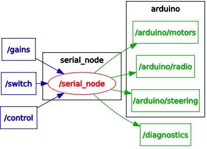

# Gigatron Motor Control Debugging Arduino Code

## ROS Debugging



## Arduino Sketch Components

### `gigabug.ino`
The main Arduino sketch file. 
* ROS publishers and subscribers are set up here
* callbacks for ROS messages are defined here
* the `setup()` function creates an instance of the `Context` class, which is where the loop that you would expect in `loop()` happens

### `context.h` and `context.cpp`
This is where everything comes together and all the magic happens.

### `commander.h` and `commander.cpp`
Class definitions for the `Commander` class and its subclasses:
* `RCCommander` for remote control mode
* `JetsonCommander` for autonomous and semiautomatic mode

### `isr.h` and `isr.cpp`
Interrupts!

### `classes.h`
Header for the PID controller and three of the smaller classes dealing with hardware. 

### `pidcontroller.cpp`
Proportional, integral, and derivative controller. Used for steering and drive motors.

### `dcservo.cpp`
The `DCServo` class for the steering servo and associated potentiometer.

### `rcdecoder.cpp`
`RCDecoder` class that translates signal from the remote control receiver into velocity and steering angle.

### `speedsensor.cpp` 
`SpeedSensor` class for calculating speed based on Hall Effect sensors.

## Installation Instructions


```
sudo apt-get install arduino arduino-core           # install Arduino IDE
sudo apt-get install ros-indigo-rosserial-arduino   # install rosserial_arduino ROS package
```
Clone this repository into your Arduino sketchbook folder:
```
cd <ARDUINO_SHETCHBOOK>
git clone https://github.com/5yler/gigabug.git
```

### Install the `digitalWriteFast` library


Download the [`digitalWriteFast`](https://storage.googleapis.com/google-code-archive-downloads/v2/code.google.com/digitalwritefast/) library file ([direct `.zip` file link](https://storage.googleapis.com/google-code-archive-downloads/v2/code.google.com/digitalwritefast/digitalWriteFast.zip)) and put it in the `<ARDUINO_SHETCHBOOK>/libraries` folder


### Generate Custom ROS Message Libraries For Arduino
Make sure you have the `metatron` repository cloned into a catkin workspace. For example: 
```
mkdir -p ~/giga_ws/src/
cd ~/giga_ws/src/
catkin_init_workspace
git clone https://github.com/5yler/metatron.git
cd ~/giga_ws
catkin_make
source devel/setup.bash
```
Optionally add `source ~/giga_ws/devel/setup.bash` to your `~/.bashrc` for convenience.

```
rosrun rosserial_arduino make_libraries.py <ARDUINO_SKETCHBOOK>/libraries
```

Your code should now compile!
